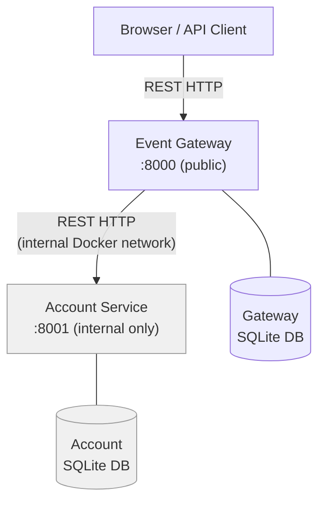
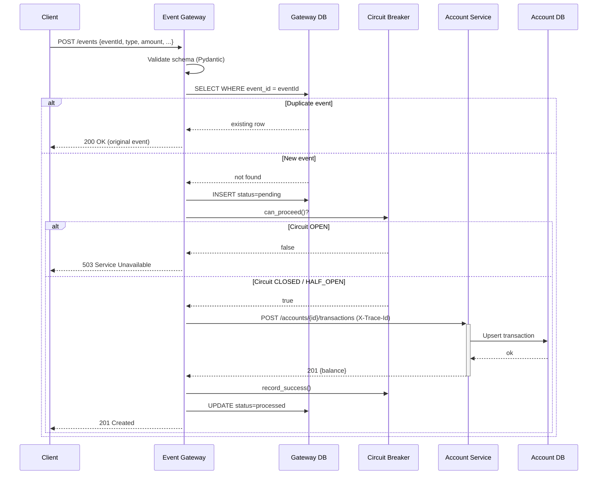
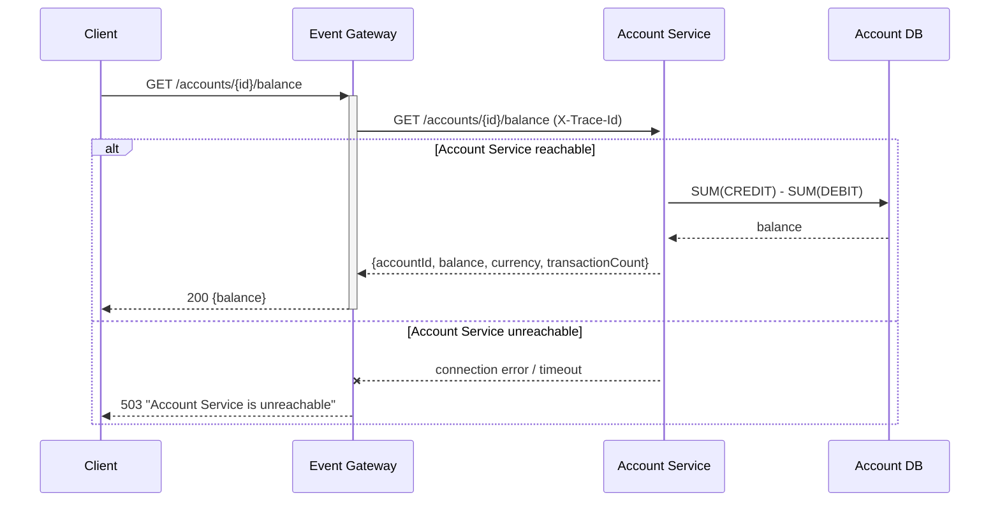
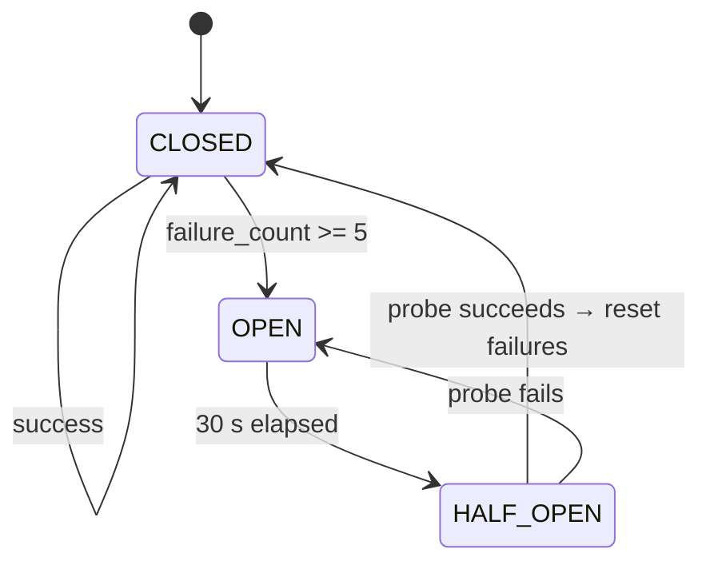
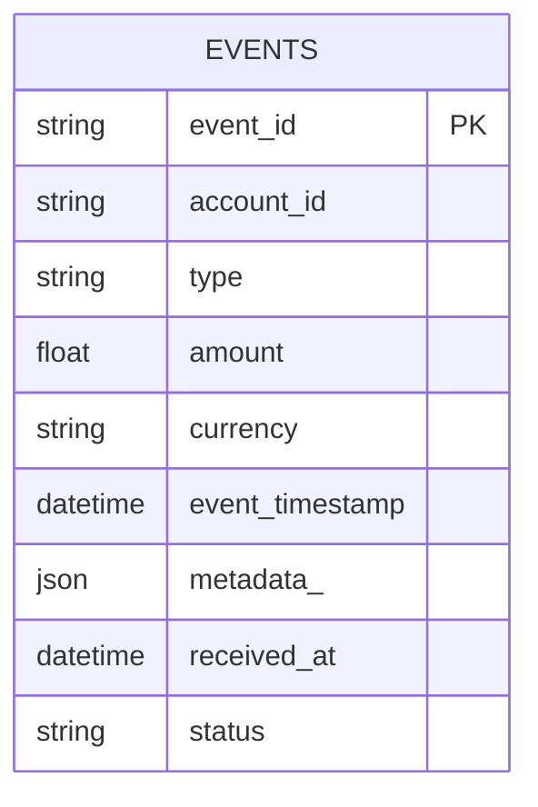
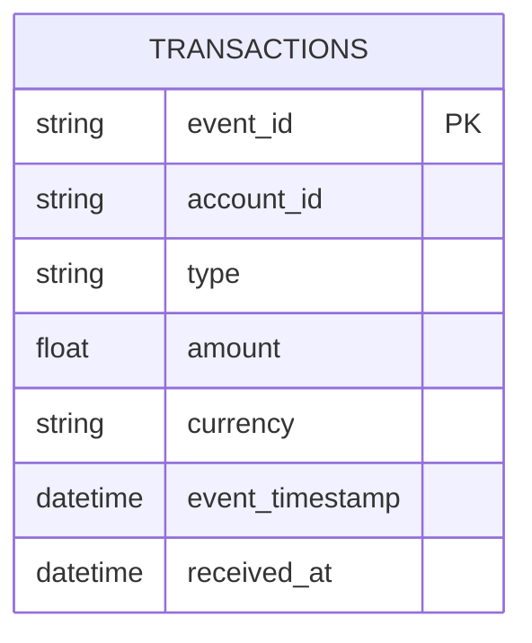

# Event Ledger — Design Document

> Generated with assistance from **Claude Code** (AI Design Agent)

---

## 1. Problem Statement

Build a financial event ledger composed of two microservices:

- **Event Gateway** (public, port 8000) — accepts raw transaction events, enforces idempotency, and forwards them to the Account Service.
- **Account Service** (internal, port 8001) — maintains per-account balances and transaction history.

Key constraints: each service owns its own database, they share no in-process state, and the Account Service must never be directly reachable by external clients.

---

## 2. System Architecture



- The Account Service has **no host port mapping** — it is unreachable from outside Docker's internal network.
- Each service has its own isolated SQLite database; they never share a connection.

---

## 3. Request Flow — POST /events



---

## 4. GET /accounts/{id}/balance Flow



---

## 5. Resiliency — Circuit Breaker State Machine



| Layer | Config | Protects against |
|---|---|---|
| Timeout | 5 s per attempt | Slow / hung Account Service |
| Retry + exponential back-off | 3 attempts, 0.5 s → 1 s → 2 s | Transient network blips |
| Circuit Breaker | Opens at 5 failures; recovers after 30 s | Sustained outages |

All three are applied on every outbound call from the Gateway to the Account Service.

---

## 6. Data Models

### Event Gateway — `events` table



`status` values: `pending` → `processed` | `failed`

### Account Service — `transactions` table



Balance is computed on-the-fly: `SUM(amount WHERE type=CREDIT) - SUM(amount WHERE type=DEBIT)`.  
No separate `accounts` table — accounts are discovered from their first transaction.

---

## 7. API Contract

### Event Gateway (public — port 8000)

| Method | Path | Request | Success | Error |
|---|---|---|---|---|
| `POST` | `/events` | EventCreate JSON | `201` new / `200` duplicate | `422` validation / `503` Account Service down |
| `GET` | `/events/{id}` | — | `200` EventResponse | `404` not found |
| `GET` | `/events?account={id}` | — | `200` EventListResponse | — |
| `GET` | `/accounts/{id}/balance` | — | `200` BalanceResponse | `503` Account Service unreachable |
| `GET` | `/health` | — | `200` HealthResponse | — |

### EventCreate schema

```json
{
  "eventId":        "string (required, unique)",
  "accountId":      "string (required)",
  "type":           "CREDIT | DEBIT",
  "amount":         "float > 0",
  "currency":       "string, 3 chars (e.g. USD)",
  "eventTimestamp": "ISO 8601 datetime",
  "metadata":       "object (optional)"
}
```

---

## 8. Distributed Tracing

Every request is assigned a `trace_id` (UUID) by the Gateway middleware — either from the incoming `X-Trace-Id` header or auto-generated. The `trace_id` is stored once in `request.state` and flows through:

1. All Gateway structured log lines for that request
2. The `X-Trace-Id` header forwarded to Account Service
3. All Account Service structured log lines for that request
4. The `x-trace-id` response header returned to the client

This makes every client request traceable end-to-end across both services using only log correlation.

---

## 9. Key Design Decisions

| Decision | Choice | Rationale |
|---|---|---|
| Database | SQLite (embedded) | Zero external dependencies; spec permits it; suitable for single-instance services |
| Communication | Synchronous REST | Simplest; spec does not require async messaging |
| Idempotency | `eventId` primary key check before insert | Guarantees exactly-once processing without distributed transactions |
| Balance computation | Computed from raw transactions | No balance column to keep in sync; always consistent |
| Ordering | `ORDER BY event_timestamp ASC` | Spec requires out-of-order event tolerance |
| Tracing | Manual `X-Trace-Id` propagation | OTel preferred but not required; keeps dependency footprint minimal |
| Account Service visibility | No host port in docker-compose | Spec requires internal-only; Docker network isolation enforces this |
| Duplicate HTTP status | `200` (not `201`) | `201 Created` is wrong for an already-existing record |
