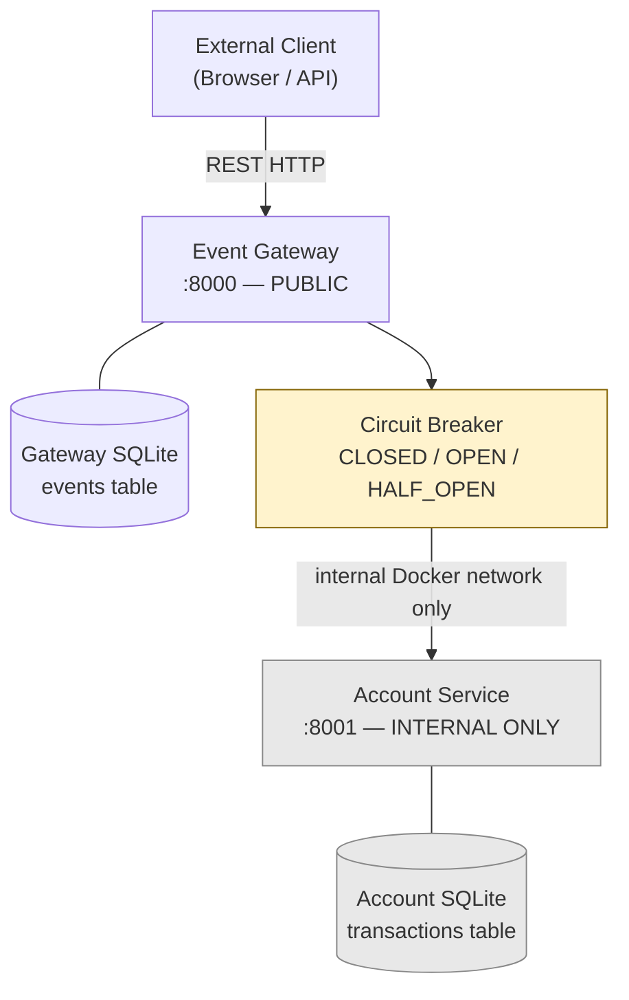
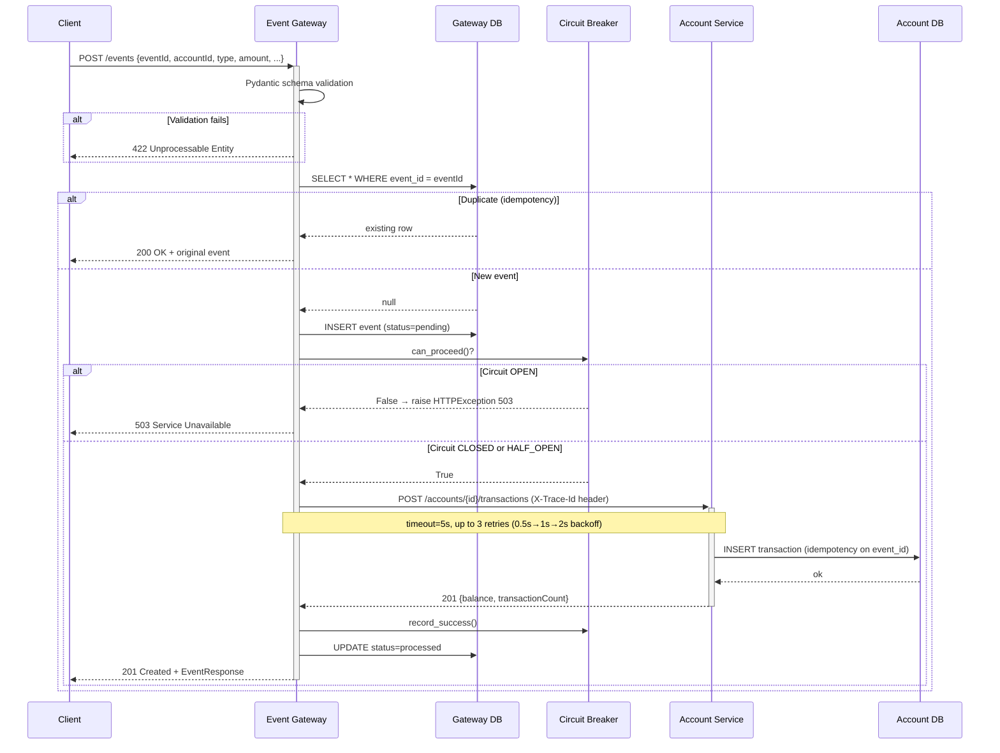
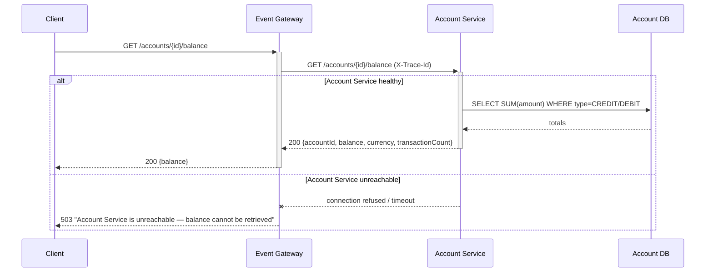
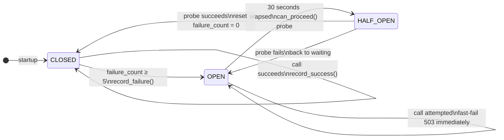
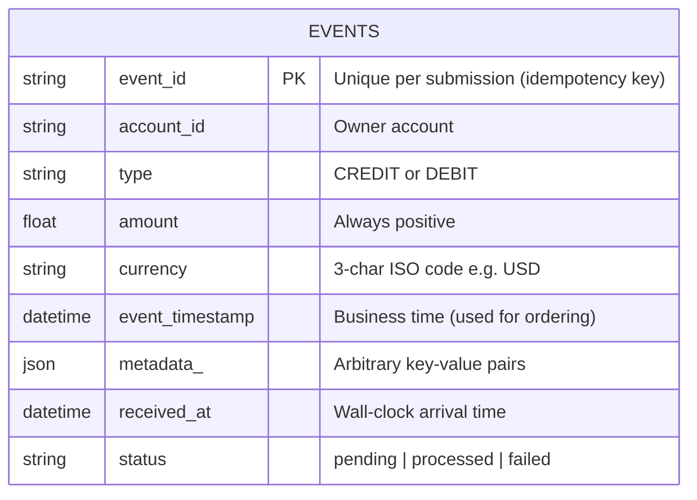
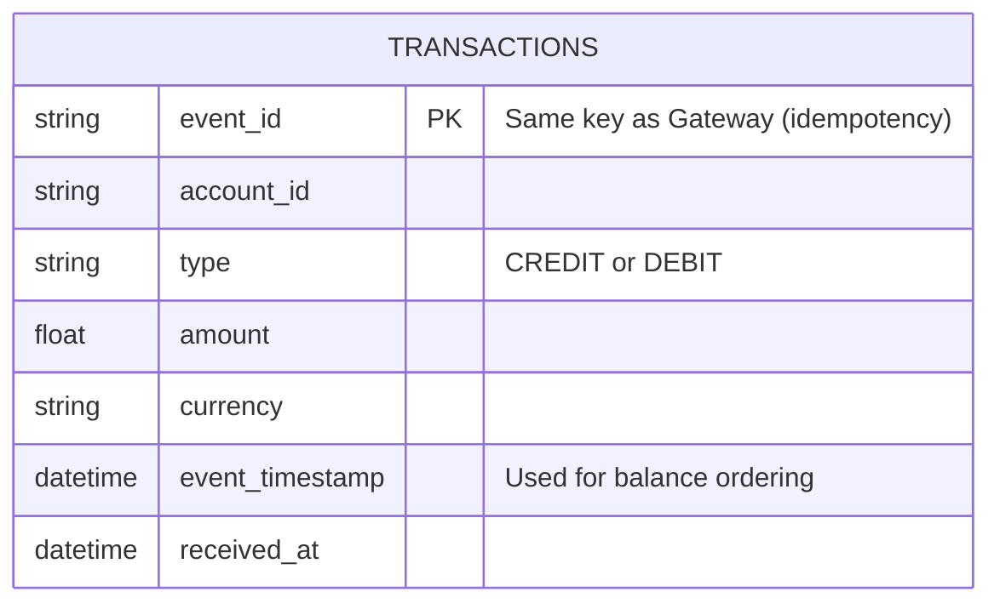
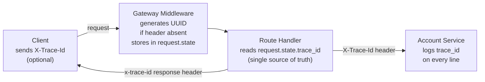

# Event Ledger — Design Document

> Generated by **Design Agent** (`agents/design_agent.py`) using Claude claude-sonnet-4-6

---

## Executive Summary

The Event Ledger is a two-microservice financial transaction system where an **Event Gateway** (public, port 8000) serves as the sole external entry point, validating and deduplicating incoming transaction events before forwarding them to an internal **Account Service** (port 8001) that maintains account balances. The services share no database or in-process state, communicate via synchronous REST, and implement layered resiliency (timeout + retry + circuit breaker) to handle Account Service failures gracefully.

---

## System Architecture



**Key architectural rule:** The Account Service has no `ports:` mapping in `docker-compose.yml` — it is physically unreachable from outside Docker's bridge network. Clients interact exclusively through the Gateway.

---

## Sequence Diagram — POST /events



---

## Sequence Diagram — GET /accounts/{id}/balance



---

## Circuit Breaker State Machine



| State | Behaviour | Trigger |
|---|---|---|
| CLOSED | Normal operation | Default |
| OPEN | Immediate 503, no call made | 5 consecutive failures |
| HALF_OPEN | One probe call allowed | 30 s after opening |

---

## Data Models

### Event Gateway — `events` table



### Account Service — `transactions` table



**Balance formula:** `balance = SUM(amount WHERE type='CREDIT') − SUM(amount WHERE type='DEBIT')`  
Computed on every `GET /balance` request — no cached balance column that could diverge.

---

## API Contract

### Event Gateway (port 8000 — public)

| Method | Path | Request Body | Success | Error codes |
|---|---|---|---|---|
| `POST` | `/events` | EventCreate JSON | `201` new / `200` duplicate | `422` validation, `503` AS down |
| `GET` | `/events/{id}` | — | `200` EventResponse | `404` not found |
| `GET` | `/events?account={id}` | — | `200` EventListResponse | — |
| `GET` | `/accounts/{id}/balance` | — | `200` BalanceResponse | `503` AS unreachable |
| `GET` | `/health` | — | `200` HealthResponse (CB state + metrics) | — |

### Account Service (port 8001 — internal Docker network only)

| Method | Path | Called by | Notes |
|---|---|---|---|
| `POST` | `/accounts/{id}/transactions` | Gateway | Idempotent on `event_id` |
| `GET` | `/accounts/{id}/balance` | Gateway proxy | Returns computed balance |
| `GET` | `/accounts/{id}` | Gateway | Full transaction history |
| `GET` | `/health` | Docker health check | DB connectivity |

### EventCreate Schema

```json
{
  "eventId":        "string  — unique per event (idempotency key)",
  "accountId":      "string  — target account",
  "type":           "CREDIT | DEBIT",
  "amount":         "float > 0",
  "currency":       "string, exactly 3 chars (e.g. USD)",
  "eventTimestamp": "ISO 8601 datetime string",
  "metadata":       "object (optional, any key-value pairs)"
}
```

---

## Distributed Tracing



Every JSON log line from both services contains `"trace_id": "<uuid>"` — a single client request is traceable end-to-end purely via log correlation.

---

## Key Design Decisions

| Decision | Choice | Rationale |
|---|---|---|
| Database | SQLite (embedded, per service) | Zero external deps; spec permits it; each service owns its data |
| Communication style | Synchronous REST | Simplest; spec does not require async messaging; easy to reason about |
| Balance storage | Computed from raw transactions | Eliminates balance/transaction drift; consistent by construction |
| Idempotency enforcement | `event_id` as primary key in both DBs | Database-level guarantee; no distributed transaction needed |
| Out-of-order handling | `ORDER BY event_timestamp ASC` | `received_at` reflects network timing, not business time |
| Tracing | Manual `X-Trace-Id` UUID propagation | OTel preferred but not required; keeps dependencies minimal |
| Duplicate HTTP response | `200 OK` (not `201 Created`) | `201` implies creation; returning existing record is not creation |
| Account Service isolation | No `ports:` in docker-compose | Enforced at infrastructure level, not just by convention |
| Resiliency stack | Timeout + Retry + Circuit Breaker | Each layer addresses a distinct failure mode; together they prevent cascade |
