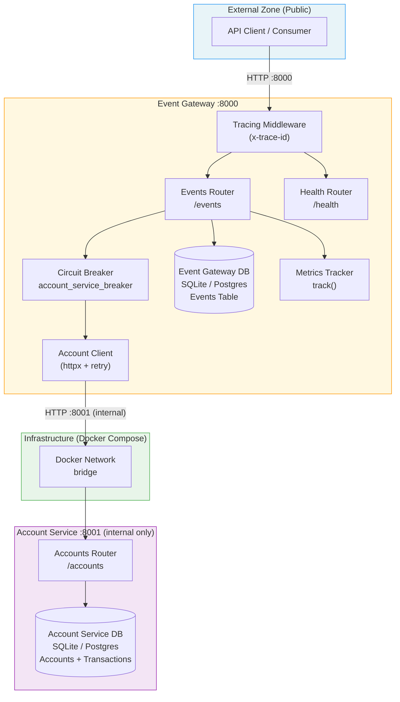
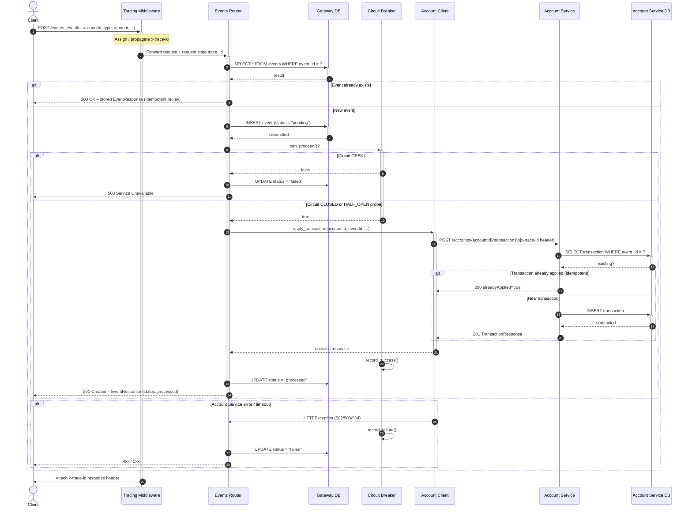
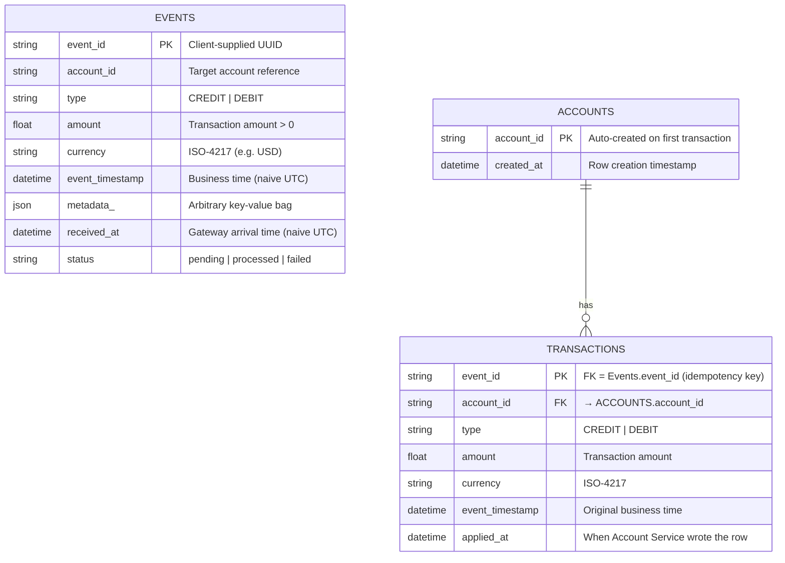
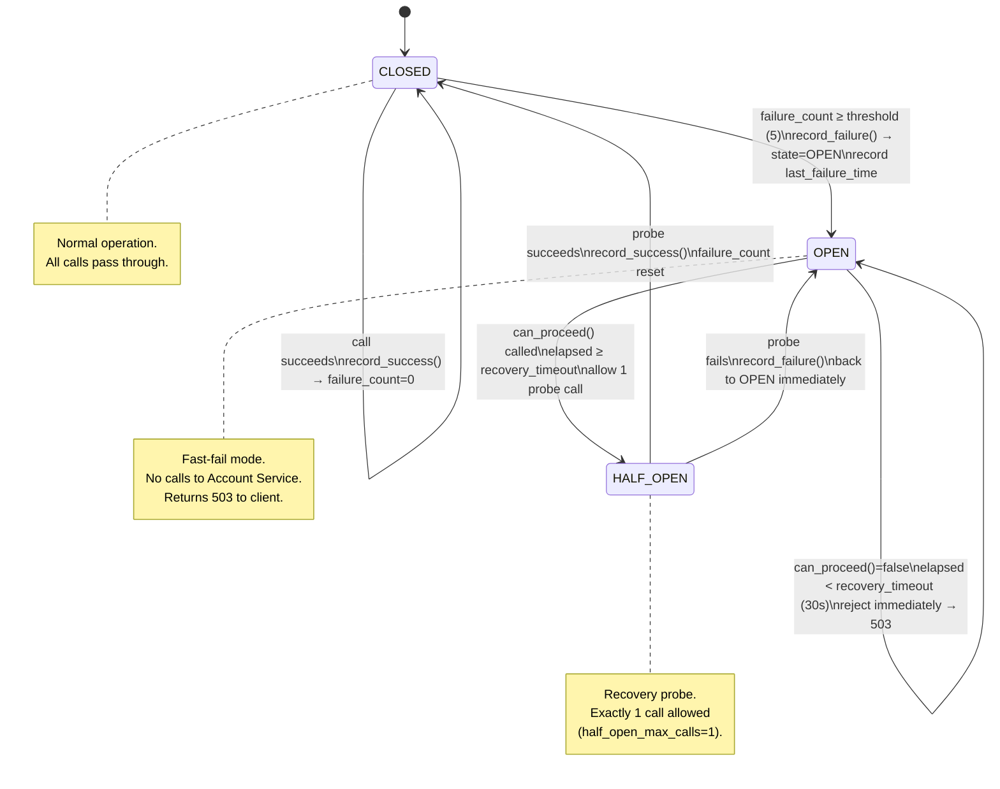
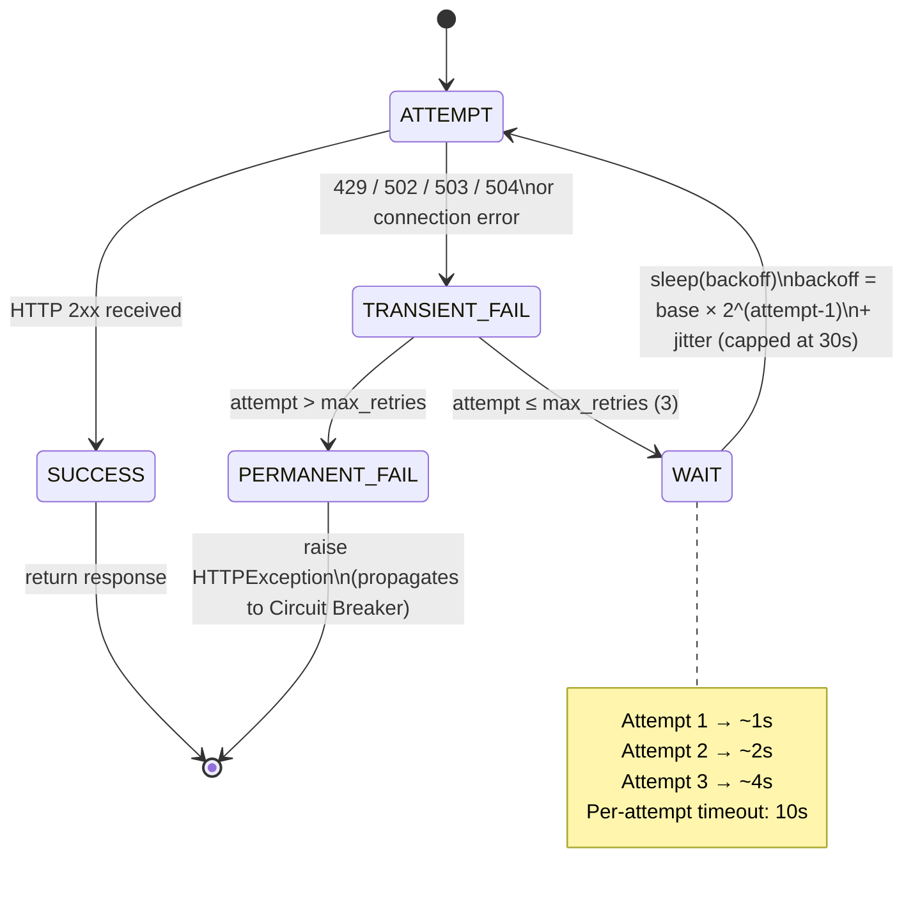

# Event Ledger – Comprehensive Design Document

## Executive Summary

The Event Ledger system is a dual-service, event-driven financial transaction platform composed of a public-facing **Event Gateway** and an internal **Account Service**. The Gateway accepts, deduplicates, and persists transaction events before forwarding them to the Account Service for balance computation, with full idempotency guarantees at both service boundaries. Resiliency is enforced via a thread-safe Circuit Breaker, exponential-backoff retry, and per-request timeouts, ensuring graceful degradation when the Account Service is unavailable.

---

## System Architecture Overview



---

## Sequence Diagram – `POST /events` Main Flow



---

## Data Model



> **Note:** `EVENTS` lives in the Gateway database; `ACCOUNTS` and `TRANSACTIONS` live in the Account Service database. The two databases are logically separate (one per container).

---

## API Contract

### Event Gateway (`http://localhost:8000`)

| Method | Path | Request Body / Params | Success Response | Error Responses | Description |
|--------|------|-----------------------|-----------------|-----------------|-------------|
| `POST` | `/events` | `EventCreate` JSON body | `201 EventResponse`<br>`200 EventResponse` (duplicate) | `422` validation<br>`503` circuit open<br>`502/504` upstream | Submit a new transaction event; idempotent on `eventId` |
| `GET` | `/events/{event_id}` | Path: `event_id` (string) | `200 EventResponse` | `404` not found | Retrieve a single event by its ID |
| `GET` | `/events` | Query: `account` (optional string) | `200 EventListResponse` | — | List all events, optionally filtered by `accountId`, ordered by `event_timestamp ASC` |
| `GET` | `/accounts/{account_id}/balance` | Path: `account_id` | `200 BalanceResponse` | `404` account not found<br>`503` upstream unavailable | Proxy balance query to Account Service; degrades gracefully |
| `GET` | `/health` | — | `200 {"status":"ok"}` | — | Gateway liveness / readiness probe |
| `GET` | `/` | — | `200` service manifest JSON | — | Service discovery root |

### Account Service (`http://account-service:8001` – internal only)

| Method | Path | Request Body / Headers | Success Response | Error Responses | Description |
|--------|------|------------------------|-----------------|-----------------|-------------|
| `POST` | `/accounts/{accountId}/transactions` | `TransactionRequest` JSON body<br>`x-trace-id` header | `201 TransactionResponse`<br>`200` (already applied, `alreadyApplied=true`) | `422` validation | Apply a CREDIT or DEBIT; idempotent on `eventId` |
| `GET` | `/accounts/{accountId}/balance` | Path: `accountId`<br>`x-trace-id` header | `200 BalanceResponse` (`balance`, `currency`, `transactionCount`) | `404` not found | Compute running balance by summing all transactions |
| `GET` | `/accounts/{accountId}` | Path: `accountId`<br>`x-trace-id` header | `200 AccountDetailsResponse` (balance + last 20 transactions) | `404` not found | Full account details with recent transaction history |
| `GET` | `/health` | — | `200 {"status":"ok"}` | — | Account Service liveness probe |

### Schema Reference

```
EventCreate          → { eventId, accountId, type, amount, currency, eventTimestamp, metadata? }
EventResponse        → { eventId, accountId, type, amount, currency, eventTimestamp, metadata,
                         receivedAt, status }
EventListResponse    → { events: EventResponse[], total: int }
TransactionRequest   → { eventId, type, amount, currency, eventTimestamp }
TransactionResponse  → { eventId, accountId, type, amount, currency, eventTimestamp,
                         appliedAt, alreadyApplied }
BalanceResponse      → { accountId, balance, currency, transactionCount }
AccountDetailsResponse → { accountId, balance, currency, recentTransactions, createdAt }
```

---

## Resiliency Patterns

### Circuit Breaker State Diagram



### Retry Policy (Account Client)



### Timeout Hierarchy

| Layer | Mechanism | Value | Action on Breach |
|-------|-----------|-------|-----------------|
| Per HTTP call to Account Service | `httpx` request timeout | 10 s | Raises `TimeoutException` → counted as failure |
| Total retry budget | Retry policy ceiling | ~30 s | Raises `HTTPException(504)` |
| Docker health-check | `urllib.request` probe | 5 s timeout | Container marked unhealthy; restarts |

---

## Key Design Decisions

| # | Decision | Choice Made | Rationale |
|---|----------|-------------|-----------|
| 1 | **Service decomposition** | Two services: Event Gateway + Account Service | Separation of concerns – the Gateway owns event persistence/idempotency; the Account Service owns financial state. Enables independent scaling and deployment. |
| 2 | **Idempotency strategy** | Client-supplied `eventId` as the idempotency key, checked at both service boundaries | Prevents duplicate balance mutations from network retries. Double-checked in both Gateway (`events` table) and Account Service (`transactions` table) for defense-in-depth. |
| 3 | **Event status state machine** | `pending → processed \| failed` written to Gateway DB before calling downstream | Provides an audit trail and allows dead-letter recovery. The Gateway DB record exists even if the Account Service is down. |
| 4 | **Circuit Breaker implementation** | Custom thread-safe `CircuitBreaker` class (no external lib) | Zero additional dependencies; full control over thresholds, recovery timeout, and logging. Singleton `account_service_breaker` shared across all requests. |
| 5 | **Account Service network isolation** | No host ports exposed; reachable only via Docker internal network | Reduces attack surface; the Account Service is never directly callable from outside the compose stack, enforcing the Gateway as the single ingress. |
| 6 | **Trace propagation** | Single `x-trace-id` generated/forwarded by Tracing Middleware; propagated as HTTP header to Account Service | End-to-end request correlation across service boundaries without a full distributed tracing framework (e.g., Jaeger). |
| 7 | **Timezone handling** | Strip timezone info (`_naive()`) before DB writes | SQLite (and some Postgres ORM configurations) do not store `tzinfo`; naive UTC is stored consistently and avoids comparison bugs. |
| 8 | **Balance computation** | Real-time sum of all transactions at query time | Simple, always-consistent. Trade-off accepted: O(n) per balance query. A running-balance column would be needed at scale. |
| 9 | **Auto-create accounts** | Account row created on first transaction if it doesn't exist | Eliminates a separate account-registration step, simplifying the client workflow at the cost of losing a formal account-creation audit event. |
| 10 | **Metrics** | Lightweight `track()` counter function | Provides basic observability without requiring Prometheus/StatsD. Designed as a seam to be replaced with a real metrics backend. |
| 11 | **Database per service** | Each service owns its own DB (shared-nothing) | Prevents tight coupling at the data layer. Schema changes in one service do not affect the other. |
| 12 | **FastAPI + SQLAlchemy ORM** | Synchronous SQLAlchemy sessions via `Depends(get_db)` in otherwise async FastAPI handlers | Pragmatic choice for SQLite compatibility and simplicity. Full async (`asyncpg`) would be preferred for production Postgres. |

---

## Constraints and Trade-offs

### Constraints

| Constraint | Impact |
|------------|--------|
| **SQLite as default DB** | Not safe for multi-process/multi-replica deployments; single-file database with writer contention. Must be replaced with Postgres for any horizontal scaling. |
| **Synchronous DB sessions in async handlers** | SQLAlchemy sync sessions block the event loop under high concurrency. Acceptable for low-to-medium load; requires `asyncpg` + `SQLAlchemy async` session for production scale. |
| **In-process Circuit Breaker state** | State is not shared across multiple gateway replicas. Each replica maintains independent failure counts; the circuit may be open on one instance and closed on another. A distributed state store (Redis) would be required for true fleet-wide protection. |
| **Real-time balance calculation** | `_calculate_balance` fetches and sums